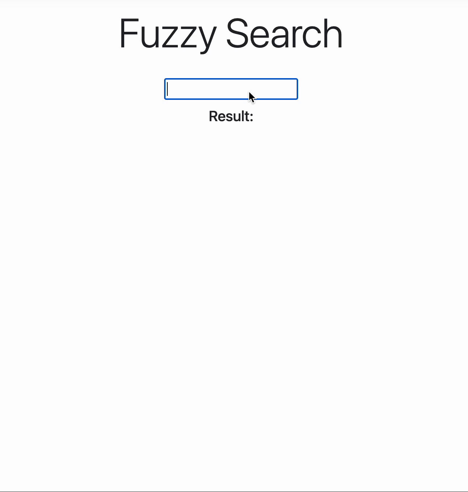

## 模糊搜尋 - Fuzzy Search
---
### 使用 Levenshtein Distance 作為計算 Edit Distance 的方法
* Server 讀取單字檔
* 前端做模糊搜尋
* 動態展示搜尋結果
* 僅回傳比對分數大於 0.7 以上的結果
* 分數計算方式： 1.0 - ((最短編輯距離 / 字串長度))
    1. 最短編輯距離：透過計算 Levenshtein Distance 取得
    2. 字串長度：取輸入與比對目標較長者

